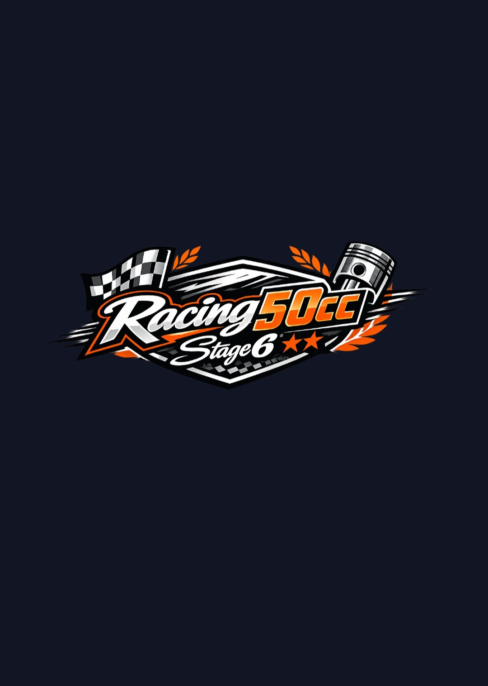

# 🏁 **RACING50CC**
### *Piaggio Zip SP*
*Performance • Tuning • Racing*

---

## 🔥 Projet Performance 50cc  
**Préparation complète d’un Piaggio Zip SP**  
Optimisation moteur • Transmission • Tests dynamiques • Analyses • Simulations

---

---

# 🧩 Présentation

**Racing50cc** est un projet dédié à la performance mécanique autour d’un **Piaggio Zip SP 50cc**.  
Objectif : créer une machine optimisée, documentée, testée, et poussée au maximum de ses capacités.

Le projet inclut :

- Préparation moteur complète  
- Réglages avancés (carburation, variation, allumage)  
- Analyse de performance & courbes  
- Simulations théoriques  
- Tests dynamiques  
- Documentation technique  
- Suivi versionné (roadmap, changelog)  

---

# 🔧 Configuration & Build

Retrouve toutes les configurations testées :

- Bas moteur  
- Haut moteur  
- Carburation  
- Allumage  
- Échappement  
- Transmission  
- Refroidissement  

👉 Voir : **/build/**

---

# 🎯 Tuning & Réglages

Documentation complète des réglages :

- Variation  
- Galets  
- Ressorts  
- Courroie  
- Gicleurs  
- Avance à l’allumage  

👉 Voir : **/tuning/**

---

# 📈 Performance & Tests

Analyses :

- Courbes de puissance  
- Accélération  
- Vitesse max  
- Comparaison configurations  
- Logs runs  

👉 Voir : **/performance/**

---

# 🧪 Simulations

Modèles théoriques :

- Transmission  
- Accélération  
- Courbes moteur  
- Température  
- Consommation  

👉 Voir : **/simulations/**

---

# 🏆 Sponsors Officiels

### 🔥 **Stage6 France**  
### 🔧 **Polini France**  
### 🛠 **Girardo France**

👉 Voir : **SPONSORS.md**

---

# 🤝 Partenaires

👉 Voir : **PARTNERS.md**

---

# 🗺 Roadmap

- v1.0 — Base  
- v1.1 — Tuning avancé  
- v1.2 — Performance & logs  
- v1.3 — Simulations  
- v1.4 — Tests dynamiques  
- v1.5 — Version complète Racing  

👉 Voir : **ROADMAP.md**

---

# 📬 Contact

- Projet : **Racing50cc**  
- Auteur : **Teremu**  
- Localisation : Toulouse, France  

---

### 🏁 *Racing50cc — Performance, précision, passion.*

